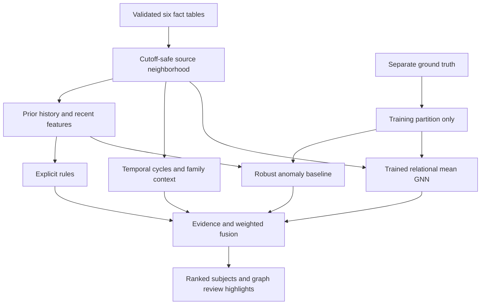

# Intelligence engine guide

The active domain for the new six-phase project is `src/prysm_intelligence/`. It consumes the [Phase 1 canonical dataset](../data/benchmarks/prysm-benchmark-v1/DATASET_MANIFEST.md) directly. Its public operation is:

```python
result = engine.investigate("Person:P01870", "2025-12-11T10:00:00Z")
```

The result contains an attention assessment, component breakdown, findings, source evidence and an annotated graph. It does not perform authentication, call an LLM, manage a database, serve HTTP or assign guilt. Existing HTTP consumers continue through the archived v1 engine until the later integration phase.

## Run it

From the repository root, using the existing Python/NumPy/pandas/PyArrow environment:

```powershell
# Validate immutable input, train on train only, and emit all 240 observations.
python ai-engine/scripts/run_intelligence.py build
python ai-engine/scripts/run_intelligence.py evaluate

# Investigate one subject with the persisted models.
python ai-engine/scripts/run_intelligence.py investigate --subject Person:P01870 --cutoff 2025-12-11T10:00:00Z --output .tmp/structuring-investigation.json

# Rank all observed people at one cutoff; N is configurable.
python ai-engine/scripts/run_intelligence.py rank --cutoff 2025-12-11T10:00:00Z --top-n 10 --output .tmp/top-people.json

python -m pytest ai-engine/tests/test_phase2.py -q
```

`build` writes `ai-engine/runs/intelligence-v2/`. Existing run/result paths are not overwritten; use `--output <fresh-path>` for another run. `--dataset`, `--config` and `--models` select explicit inputs. The default config is `config/benchmark_intelligence.json`. Inference requires no additional ML framework or service. Phase 3 evaluation uses the optional matplotlib dependency for charts. Its selected model is the default for investigate/rank; see ../PHASE3_STATE.md for measured results and limitations.

For a Python caller, add `ai-engine/src` and the repository root to the import path (the CLI does this), then:

```python
from prysm_intelligence.pipeline import load_engine

engine = load_engine(
    "data/benchmarks/prysm-benchmark-v1",
    "ai-engine/runs/evaluation-v3/model_bundle.json",
)
result = engine.investigate("Person:P01870", "2025-12-11T10:00:00Z")
ranking = engine.rank(["Person:P01870", "Person:P02000"], "2025-12-11T10:00:00Z", top_n=2)
```

Phase 3 keeps the same result contract and selects a 60-epoch GNN. The package currently runs in this repository because its loader reuses the Phase 1 validator. Standalone wheel/service packaging is not part of Phase 2.

## Read the code in flow order



| Module | Responsibility |
| --- | --- |
| `data.py` | Reuse Phase 1 checksum/schema/semantic validation, keep only facts, index typed references, discover bounded neighborhoods at a cutoff. |
| `features.py` | Keep prior history separate from the observation window; calculate seven explainable behavioral measurements and exact supporting transaction IDs. |
| `rules.py` | Six deterministic checks: structured deposits, velocity, unexplained amount, physical travel, declaration/receipt mismatch, and rapid new-device outflow. |
| `network.py` | Search chronological three-transfer cycles and distinguish routes involving an active family relationship. |
| `graph.py` | Produce source-backed graph DTOs and numeric GNN tensors. |
| `anomaly.py` | Fit and reload a robust one-class behavioral baseline with additive contributions. |
| `gnn.py` | Train/reload two message-passing layers and readout; explain score sensitivity to transfer connections. |
| `fusion.py` | Combine available components while preserving weights, contribution, coverage and confidence. |
| `evidence.py` | Validate references, assign versioned evidence IDs and attach review highlights. |
| `engine.py` | Public `investigate` and `rank` operations, model eligibility, missing-component handling and result assembly. |
| `pipeline.py` | Training boundary, artifact checks, immutable run publication and raw benchmark exports. |
| `evaluation.py`, `metrics.py`, `evaluation_plots.py` | Phase 3 validation-only selection, exact errors, ranking metrics and static charts. |

## Time, membership and leakage

The default observation window is the nine days ending at the requested cutoff. Prior history extends back 120 days and **excludes those nine days**. These are investigator settings, not values read from ground-truth windows. On the benchmark they include the complete seven-day event period and avoid mixing it into the prior baseline.

`Dataset` does not retain ground truth. Neighborhood membership is discovered through typed account ownership, active relationships and observed transactions. It never reads `member_entity_keys`, evidence lists, scenario names, label IDs or split names to decide what an investigation can see. Future events and inactive relationships are excluded. Future company declarations are masked and cannot trigger tax checks.

Training alone reads the allowlisted `entity_key`, `as_of`, `is_suspicious` and `ground_truth_id` columns from the `train` partition. The ID is ordering/provenance, not a feature. The anomaly baseline uses the 72 training-normal cases; the GNN uses all 80 training cases, including eight positives. Neither preprocessing nor fitting uses validation/test observations. Modifying held-out labels or subject IDs cannot change a fit; a test exercises this boundary.

Models are available only for the trained population: observed ETB-income people with an active beneficial-ownership relationship. Relatives, employees, standalone accounts and businesses still receive applicable fact/rule/network analysis, but do not silently inherit a model trained on business owners. Model artifacts dated after a requested cutoff are excluded.

Institutions are visible reference nodes, not traversal bridges. GNN tensors contain only local Person, Company and Account nodes; institution/device IDs are excluded. Consequently shared banks cannot carry held-out information into training. The model has no learned entity-ID embeddings. Known households are disjoint across splits, and each sample is constructed independently at its own cutoff.

## Rule and network definitions

All numerical settings are in `config/benchmark_intelligence.json`. These are benchmark investigation references, not legal thresholds or production policy.

| Finding | Required combination | Evidence |
| --- | --- | --- |
| `STRUCTURED_DEPOSITS` | At least five cash deposits in 60 minutes, each 95–100% of the invented 10,000 ETB reference, entering subject accounts. | Exact clustered transactions and reference/count measurements. |
| `HIGH_VELOCITY` | At least six subject transactions in 15 minutes with at least four prior transactions. | The densest time window and prior count. |
| `UNEXPLAINED_AMOUNT` | Amount at least ten times declared ETB monthly income and five times prior median; recorded asset sales excluded. | Specific large transactions, income and historical median. Missing income/history is unavailable. |
| `IMPOSSIBLE_BRANCH_TRAVEL` | Initiating-account physical branch events separated by at least 300 km imply more than 500 km/h. | Exact successive events, great-circle distance and implied speed. Receiver locations and IP geolocation are not treated as presence. |
| `BUSINESS_RECEIPTS_MISMATCH` | Active beneficial ownership, available same-period company declaration, business-tagged receipts into personal accounts exceeding five times declared sales, and at least three receipts within 10 km of the business. | Transactions, ownership relationship, business ID, declaration amount/period/availability and proximity measurements. Nearness alone never triggers. |
| `NEW_DEVICE_RAPID_OUTFLOW` | At least three non-purchase outflows on previously unseen initiating-account devices in 60 minutes, totaling more than five times declared monthly income. | Outflow transactions, count, income and historical device comparison. |
| `RAPID_CIRCULAR_FLOW` | A chronological three-leg return to a subject account, three distinct accounts, within 60 minutes, with amounts within 5%. | Ordered paths, transaction IDs, linked owners and available business relationships. |
| `FAMILY_PASS_THROUGH` | Such a circular path passes through an owner linked to the subject by an active explicit family edge. | Ordered financial paths plus that relationship. A family link by itself has zero risk contribution. |

The cycle search uses indexed outgoing events, chronological pruning and a 20,000-comparison safeguard. Truncated searches are disclosed and excluded from fusion. Neighborhoods default to 100 traversed core nodes and 2,000 transactions. Display-only institution/device leaves can add nodes beyond the core traversal bound. This is a bounded small-data implementation, not a production-scale graph store.

## Anomaly baseline

The seven inputs are:

- Maximum recent amount relative to the **prior** median: amount changes.
- Peak 15-minute transaction count: burst behavior.
- Recent count relative to the historical rate: activity change.
- Fraction involving new counterparties: relationship behavior changes.
- Fraction of outgoing transactions using new devices: initiating-device change.
- Maximum implied branch travel speed: physical geographic inconsistency.
- Recent outflow relative to declared ETB monthly income: affordability/context deviation.

Each feature is transformed with `log1p`. Fit stores the training-normal median and `max(1.4826 * MAD, 0.2)` scale. Positive deviations become `z = max((value - median) / scale, 0)`. The score is the mean of the three largest `1 - exp(-z / 4)` values. Contributions returned in JSON sum exactly to the score and retain their transaction references. The initial alert reference is 0.65.

This is an interpretable one-class statistical anomaly model with labeled-normal reference selection, not a calibrated probability or a completely unlabeled fitting procedure. Fewer than four historical observations or no recent behavior makes it unavailable. Names, gender, birth dates, occupations, raw IDs and artificial labels are not model inputs.

## Genuine GNN

The task is **primary-subject node classification of the observed synthetic scenario**, using a local temporal financial graph. This tests whether learned neighborhood aggregation adds useful information; it does not predict future crime.

The model adapts the neighborhood mean-aggregation idea from [Hamilton, Ying and Leskovec, *Inductive Representation Learning on Large Graphs* (NeurIPS 2017)](https://proceedings.neurips.cc/paper/2017/hash/5dd9db5e033da9c6fb5ba83c7a7ebea9-Abstract.html). It is a small relational GraphSAGE-style implementation, not a reproduction of the paper's benchmark system.

Each node has eleven numerical inputs: Person/Company/Account type indicators; recent incoming/outgoing counts and ETB volumes; prior median amount; 15-minute burst count; foreign-currency share; and new-device fraction. Person/business financial statistics aggregate their owned accounts. `log1p` transformation and train-only centering/scaling precede inference. The features do not contain rule outputs or ground-truth evidence lists.

Five adjacency channels represent ownership, family, business relationships, incoming transfers and outgoing transfers. Transfer adjacency uses only the observation window; history affects node statistics. The two layers are:

```text
joined = concatenate(self_state, mean_neighbors_for_each_relation)
next_state = tanh(joined @ learned_weight + learned_bias)
readout = concatenate(subject_state, mean_of_local_node_states)
score = sigmoid(readout @ learned_output_weight + learned_output_bias)
```

Defaults are two eight-unit layers, **945 trainable parameters**, seed 20260905, 180 full-batch Adam steps, learning rate 0.025, L2 0.001, and balanced binary cross-entropy weights. **Both message layers and the readout are trained**, including their biases. Backpropagation is implemented explicitly in NumPy and checked against finite-difference gradients. Tests verify weight updates, edge sensitivity, deterministic fits and serialization.

The reported training loss excludes the L2 penalty and is training sanity only. The sigmoid is explicitly marked **not a calibrated fraud probability**. With only eight positive training cases, overfitting and weak generalization are material limitations; Phase 3 measures these limits in `reports/phase3/REPORT.md`. The GNN does not yet encode exact event ordering inside its adjacency, legal transaction purpose, travel distance or declared sales. The corresponding explicit rules retain those signals.

For a high score, the engine removes each directed account-pair transfer connection, recomputes both layers, and reports positive score drops. Parallel transactions are removed together. **Node features remain fixed**: this is limited model sensitivity, not a counterfactual about removing the underlying money movement and not causal proof. Only localized positive sensitivities can mark GNN-related graph elements for review; an unsupported global score does not paint an entire household red.

## Fusion, evidence and graph output

Initial configured weights are rules 0.45, anomaly 0.20, network 0.20 and GNN 0.15. Within rules/network, the strongest finding supplies that component's strength; repeated correlated findings do not accumulate arbitrarily. Weighted mean fusion renormalizes over available components. Missing signals are not zero-imputed. Every component preserves its strength, configured/effective weight, weighted contribution, reason and evidence IDs. Confidence is a disclosed engineering heuristic, weighted by component coverage, not statistical calibration.

Attention levels are `low` below 0.35, `moderate` from 0.35, and `high` from 0.65. With no available components the assessment is `unavailable` with null strength. A low score means low current attention, not certified innocence.

An evidence item preserves the existing integration-friendly names: `evidence_id`, `entity_id`, `signal_source`, `signal_type`, `description`, `strength`, `severity`, `confidence`, `supporting_entity_ids`, `supporting_transaction_ids`, `supporting_relationship_ids`, `supporting_edge_ids`, `measurements`, `timestamps` and `provenance`. Tax evidence identifies `companies.parquet`; model evidence references `model_bundle.json`. The source checksum, cutoff and analysis fingerprint bind the result to data, settings and model parameters. Different model/settings runs do not reuse the same evidence identities accidentally.

Graph nodes are Person, Company, Account, Institution and Device. Edges are ownership, held-at, explicit relationships, transfers and device use. Transactions are attributed edges, not duplicated transaction nodes. Every edge carries a source table/record reference and timestamp. Fields for later GNN Maze consumption are:

```json
{
  "attention": "review",
  "highlight_color": "red",
  "evidence_ids": ["EVD:..."]
}
```

The engine assigns these fields; a frontend need only render them. Red means linked to an investigation lead, including a model-sensitivity lead where stated, not confirmed misconduct. Unmarked elements have no localized finding. Whole households are not flagged merely because a relationship exists.

`rank()` evaluates supplied subjects, sorts by computed fused strength, breaks ties by typed ID and returns configurable Top N with level, cutoff, version/fingerprint, breakdown and evidence references. CLI `rank` uses all observed people, not ground-truth positive IDs. Build-time rankings are explicitly the 80 primary benchmark subjects per split, which is a different declared population.

## Artifacts and evaluation

| Output under `runs/intelligence-v2/` | Use |
| --- | --- |
| `model_bundle.json` | Configuration, training provenance, anomaly statistics, both GNN layers/readout, preprocessing and training-loss trace. Dataset checksum is checked on reload. |
| `config.json`, `MANIFEST.json` | Run configuration, source-code hashes, data checksum and generated artifact checksums. |
| `train_results.jsonl`, `validation_results.jsonl`, `test_results.jsonl` | All 240 full domain results, each with evidence and an annotated graph. Training rows are in-sample. |
| `predictions.parquet` | One row per canonical observation: ID, subject, cutoff, split, target/scenario, in-sample marker and four component/fusion scores. Labels exist in this evaluation table only. |
| `top_entities.json` | Computed Top N for each declared primary-subject split population. |
| `training_report.json` | Training counts, fitting boundary, loss endpoints and measured timings. No held-out performance claim. |

Builds stage outputs, verify model reload and JSON serialization, then rename into a fresh run directory. Numeric model/prediction outputs are reproducible for the same inputs/configuration/environment; timing fields and their manifest checksums naturally vary between runs. Artifacts are local generated outputs; committed examples provide a reviewable result and ranking, while the build command regenerates the complete run.

Phase 3 is complete: see [the handoff](../PHASE3_STATE.md) and `reports/phase3/`. It compares controlled configurations, reports all component errors and ablations, and selects 60 epochs using validation. Richer ambiguous data and probability calibration remain future work. Do not use training loss as accuracy or the tiny benchmark as real-world validation.
