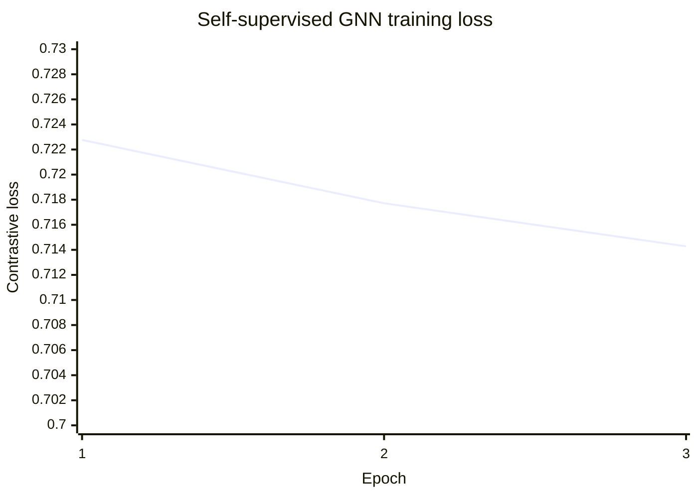
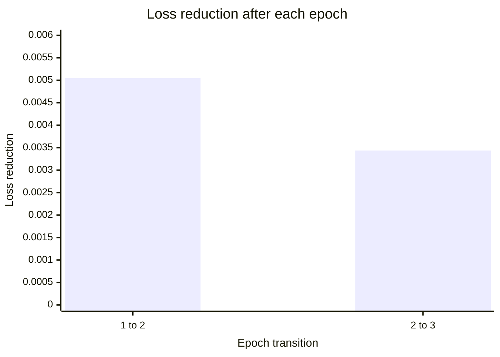

# GNN Training Loss Graphs

This report visualizes the loss recorded in the existing `relational-graphsage-structural-v1` artifact. The model used self-supervised link-contrastive training over 100,000 edges for three epochs. No labels were used, so these graphs describe optimization of structural graph representations—not fraud-prediction accuracy.

## Training loss by epoch

The loss decreased at every recorded epoch, from `0.722765` to `0.714280`. Lower loss means the contrastive projection became better at separating observed graph links from sampled negative links during training.

| Epoch | Training loss | Improvement from previous epoch |
|---:|---:|---:|
| 1 | 0.722765 | — |
| 2 | 0.717717 | 0.005048 |
| 3 | 0.714280 | 0.003436 |

## Loss reduction by epoch

This graph shows the amount of loss removed after each completed transition. The total reduction was `0.008485`, approximately `1.17%` of the first recorded loss. The smaller second reduction suggests that improvement was continuing but beginning to slow by epoch three.

## Evaluation context

The artifact evaluated structural link reconstruction on 20,000 held-out edges and recorded ROC-AUC `0.520692`. This evaluation is valid only for structural link reconstruction. It is not a confidence score, fraud probability, or supervised risk-performance claim.

| Property | Recorded value |
|---|---:|
| Model version | `relational-graphsage-structural-v1` |
| Graph rows encoded | 549,947 |
| Embedding dimensions | 16 |
| Training edges | 100,000 |
| Validation edges | 20,000 |
| Epochs | 3 |
| Labels used | No |
| Structural link-reconstruction ROC-AUC | 0.520692 |

Source: `artifacts/gnn_encoder.json` and `evaluation/phase3_evaluation.json`.
